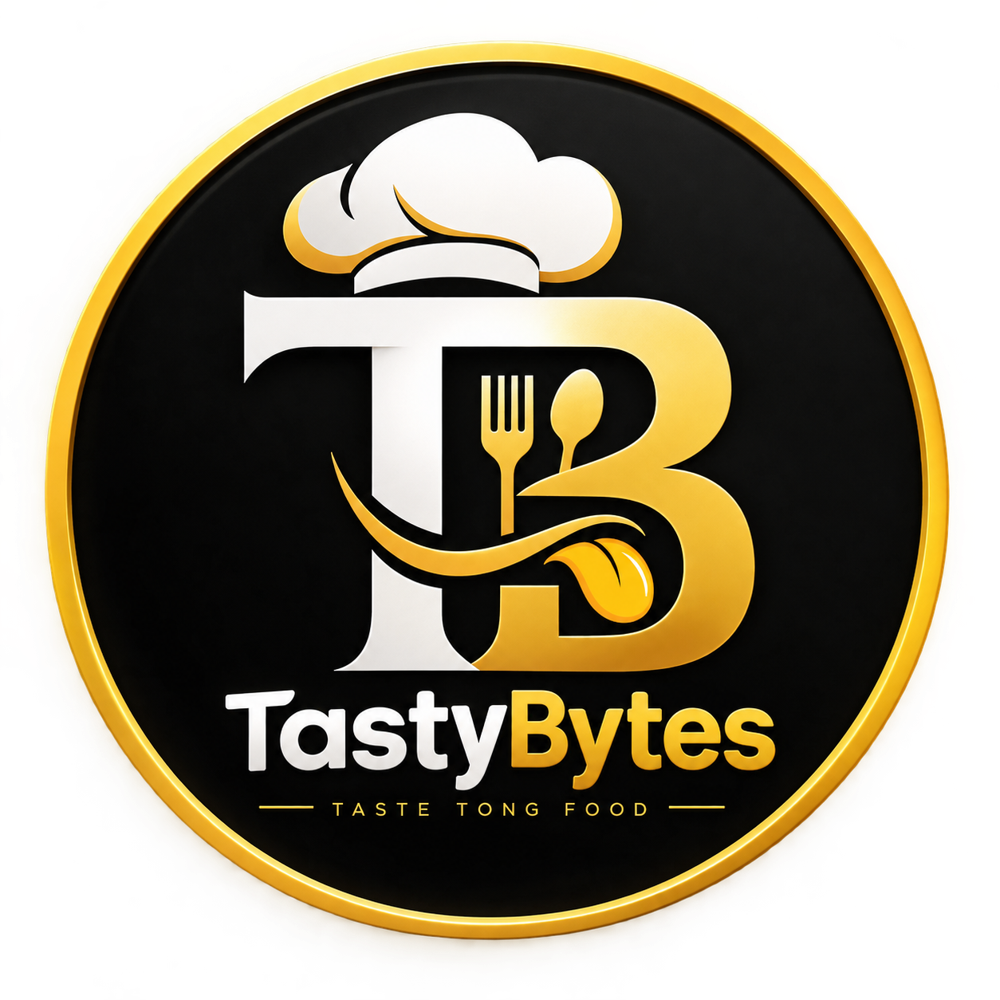

# 🍔 TastyBytes — Flutter Restaurant App

<p align="center">
  
</p>

<h1 align="center">🍔 TastyBytes</h1>

<p align="center">
  A modern and user-friendly restaurant food ordering mobile application built with Flutter.
</p>

<p align="center">
  
  
  
  
  
  
</p>

---

## 📱 About The Project

**TastyBytes** is a Flutter-based restaurant and food ordering application developed as part of **Week 7 of my Flutter Development Internship at Owasoft Technologies**.

The application provides a complete food browsing and ordering experience. Users can explore food categories, view food items, add items to the cart, select payment methods, place orders, view order history, and manage their profile.

The project focuses on:

- Modern Flutter UI
- BLoC state management
- Screen navigation
- Food category management
- Cart management
- Checkout flow
- Order history
- Profile management
- Responsive UI
- Flutter animations
- Clean project structure

---

# 🎬 App Preview

<p align="center">
  
</p>

> 🎥 Add your screen-recording GIF here after creating the GIF.

---

# ✨ Features

## 🏠 Home Screen

- Welcome section
- Food categories
- Popular food items
- Food cards
- See All categories option
- Modern restaurant UI
- Responsive layout

---

## 🍕 Food Categories

Users can explore different food categories:

- 🍕 Pizza
- 🍔 Burger
- 🍗 Chicken
- 🥤 Drinks

Each category displays its relevant food items.

---

## 🍽️ Food Details

Users can:

- View available food items
- See food name
- See food price
- View food icon/image
- Add food to cart
- See confirmation after adding an item

---

## 🛒 Shopping Cart

The cart allows users to:

- View selected food items
- Increase quantity
- Decrease quantity
- Remove items
- View total price
- Continue to checkout

---

## 💳 Checkout

The checkout screen provides:

- Delivery address
- Order summary
- Payment method selection
- Cash on Delivery
- Credit/Debit Card
- EasyPaisa
- Place Order button

---

## 🎉 Order Success

After placing an order, users see a success screen confirming that their order has been placed successfully.

---

## 📦 Order History

Users can view their previous orders and order information.

---

## 👤 Profile

The profile screen includes:

- User profile information
- Edit Profile
- Order History
- My Address
- Logout

---

# 🎨 UI & Design

The application uses a simple and modern visual style.

### Main Color Palette

| Color | Purpose |
|---|---|
| 🟨 Yellow | Primary / Food Theme |
| ⬛ Black | Text / Icons |
| ⬜ White | Cards / Background |
| 🩶 Light Grey | Secondary Background |
| 🟩 Green | Success |
| 🟥 Red | Error |

The project uses a centralized `AppColors` class to maintain consistent colors throughout the application.

---

# 🎞️ Animations

The application also includes Flutter animations to improve the user experience.

### Implemented Animation Concepts

- `AnimationController`
- `FadeTransition`
- `SlideTransition`
- `ScaleTransition`
- `AnimatedContainer`
- `AnimatedScale`
- `Hero`
- `Curves`
- FAB Hero animation
- Screen entrance animations

### Example Animation Flow

```text
Screen Opens
     ↓
AnimationController
     ↓
Fade Animation
     ↓
Slide Animation
     ↓
Widgets appear smoothly
````

---

# 🦸 Hero Animations

Hero animations are used to create smooth transitions between related UI elements.

### Category → Food Details

```text
Categories Screen
      ↓
Hero
      ↓
Food Details Screen
```

Example:

```dart
Hero(
  tag: 'Details_$name',
  child: Icon(
    icon,
    size: 28,
  ),
)
```

Destination:

```dart
Hero(
  tag: 'Details_${widget.category}',
  child: Icon(
    Icons.local_pizza,
    size: 40,
  ),
)
```

The Hero `tag` must be the same on both screens.

---

# 🧠 BLoC State Management

The project uses the **BLoC (Business Logic Component)** pattern for managing application state.

The basic flow is:

```text
       USER ACTION
            ↓
          EVENT
            ↓
           BLoC
            ↓
      BUSINESS LOGIC
            ↓
          STATE
            ↓
            UI
```

### Example

```text
User taps Pizza
       ↓
SelectCategoryEvent
       ↓
HomeBloc
       ↓
HomeCategoryChanged
       ↓
BlocBuilder
       ↓
UI Updates
```

---

# 📂 BLoC Structure

Each feature has its own BLoC files.

```text
bloc/
├── home_bloc.dart
├── home_event.dart
└── home_state.dart
```

### Event

Events represent actions performed by the user or application.

```dart
class SelectCategoryEvent extends HomeEvent {
  final int index;

  SelectCategoryEvent(this.index);
}
```

### BLoC

BLoC receives events and produces states.

```dart
on<SelectCategoryEvent>((event, emit) {
  emit(HomeCategoryChanged(event.index));
});
```

### State

State represents the current UI/application condition.

```dart
class HomeCategoryChanged extends HomeState {
  HomeCategoryChanged(int index) : super(index);
}
```

### UI

`BlocBuilder` listens to state changes.

```dart
BlocBuilder<HomeBloc, HomeState>(
  builder: (context, state) {
    return Text(
      '${state.selectedCategory}',
    );
  },
)
```

---

# 🧭 Application Navigation Flow

The main application flow is:

```text
              Splash
                ↓
            Onboarding
                ↓
            Main Screen
                ↓
        ┌───────┼────────┐
        ↓       ↓        ↓
      Home    Orders    Cart
        ↓                 ↓
   Categories          Checkout
        ↓                 ↓
   Food Details       Order Success
        ↓
      Cart
```

### Main Navigation

```text
Home
├── Categories
│   └── Food Details
│       └── Cart
│           └── Checkout
│               └── Order Success
│
├── Order History
│
├── Cart
│
└── Profile
```

---

# 🏗️ Project Architecture

The project follows a feature-based structure.

```text
lib/
│
├── core/
│   ├── constants/
│   │   └── app_colors.dart
│   │
│   └── ...
│
├── features/
│
│   ├── splash/
│   │   └── screen/
│   │       └── splash_screen.dart
│   │
│   ├── onboarding/
│   │   └── screen/
│   │       └── onboarding_screen.dart
│   │
│   ├── home/
│   │   ├── bloc/
│   │   │   ├── home_bloc.dart
│   │   │   ├── home_event.dart
│   │   │   └── home_state.dart
│   │   │
│   │   └── screen/
│   │       └── home_screen.dart
│   │
│   ├── categories/
│   │   ├── bloc/
│   │   │   ├── categories_bloc.dart
│   │   │   ├── categories_event.dart
│   │   │   └── categories_state.dart
│   │   │
│   │   └── screen/
│   │       └── categories_screen.dart
│   │
│   ├── food_details/
│   │   ├── bloc/
│   │   │   ├── food_details_bloc.dart
│   │   │   ├── food_details_event.dart
│   │   │   └── food_details_state.dart
│   │   │
│   │   └── screen/
│   │       └── food_details_screen.dart
│   │
│   ├── cart/
│   │   ├── bloc/
│   │   │   ├── cart_bloc.dart
│   │   │   ├── cart_event.dart
│   │   │   └── cart_state.dart
│   │   │
│   │   └── screen/
│   │       └── cart_screen.dart
│   │
│   ├── checkout/
│   │   ├── bloc/
│   │   │   ├── checkout_bloc.dart
│   │   │   ├── checkout_event.dart
│   │   │   └── checkout_state.dart
│   │   │
│   │   └── screen/
│   │       └── checkout_screen.dart
│   │
│   ├── order_success/
│   │   └── screen/
│   │       └── order_success_screen.dart
│   │
│   ├── order_history/
│   │   ├── bloc/
│   │   └── screen/
│   │       └── order_history_screen.dart
│   │
│   └── profile/
│       ├── bloc/
│       └── screen/
│           └── profile_screen.dart
│
└── main.dart
```

---

# 🛠️ Technologies Used

| Technology          | Usage                          |
| ------------------- | ------------------------------ |
| Flutter             | Mobile application development |
| Dart                | Programming language           |
| BLoC                | State management               |
| Flutter ScreenUtil  | Responsive UI                  |
| Sqflite             | Local database                 |
| Material Design     | UI components                  |
| Hero                | Screen transition animation    |
| AnimationController | Custom animations              |
| AnimatedContainer   | Implicit animations            |
| Git                 | Version control                |
| GitHub              | Source code hosting            |
| Android Studio      | Development                    |
| VS Code             | Development                    |

---

# 📦 Dependencies

Main packages used in the project:

```yaml
dependencies:
  flutter:
    sdk: flutter

  flutter_bloc:
  flutter_screenutil:
  sqflite:
  path:
  lottie:
```

Run:

```bash
flutter pub get
```

---

# 🖼️ Assets

The project uses local assets for application branding and food items.

```text
assets/
│
├── logo/
│   └── logo.png
│
├── onboarding/
│   ├── food.png
│   ├── delivery.png
│   └── enjoy.png
│
├── animation/
│   ├── Bike.json
│   └── Burger.json
│
└── food/
    ├── burger.png
    ├── pizza.png
    ├── pasta.png
    └── drink.png
```

---

# 📱 Screens

The application contains the following major screens:

| #  | Screen        | Description                  |
| -- | ------------- | ---------------------------- |
| 1  | Splash        | Application launch screen    |
| 2  | Onboarding    | Introduction to the app      |
| 3  | Home          | Main food browsing screen    |
| 4  | Categories    | Food category selection      |
| 5  | Food Details  | Food items and add-to-cart   |
| 6  | Cart          | Selected food and quantities |
| 7  | Checkout      | Address and payment          |
| 8  | Order Success | Order confirmation           |
| 9  | Order History | Previous orders              |
| 10 | Profile       | User profile and settings    |

---

# 🔄 State Management Flow

### Home

```text
HomeScreen
    ↓
SelectCategoryEvent
    ↓
HomeBloc
    ↓
HomeCategoryChanged
    ↓
BlocBuilder
    ↓
Updated UI
```

### Categories

```text
CategoriesScreen
       ↓
SelectCategoryEvent
       ↓
CategoriesBloc
       ↓
CategorySelected
       ↓
BlocBuilder
       ↓
Updated Categories
```

### Cart

```text
Food Details
      ↓
AddCartItem
      ↓
CartBloc
      ↓
Cart State
      ↓
Cart UI
```

### Checkout

```text
User selects payment
        ↓
SelectPaymentMethod
        ↓
CheckoutBloc
        ↓
CheckoutUpdated
        ↓
Checkout UI
```

---

# 🧩 UI Components

The application uses Flutter's built-in widgets including:

* `Scaffold`
* `AppBar`
* `PreferredSize`
* `Container`
* `Column`
* `Row`
* `Expanded`
* `ListView`
* `ListView.builder`
* `GestureDetector`
* `ElevatedButton`
* `IconButton`
* `NavigationBar`
* `NavigationDestination`
* `FloatingActionButton`
* `Badge`
* `TextField`
* `RadioListTile`
* `CircleAvatar`
* `AnimatedContainer`
* `AnimatedScale`
* `FadeTransition`
* `SlideTransition`
* `Hero`

---

# 📐 Responsive Design

The application uses `flutter_screenutil` for responsive sizing.

Example:

```dart
Text(
  'TastyBytes',
  style: TextStyle(
    fontSize: 20.sp,
    fontWeight: FontWeight.bold,
  ),
)
```

Other examples:

```dart
SizedBox(
  height: 20.h,
)
```

```dart
Padding(
  padding: EdgeInsets.all(16.w),
)
```

```dart
BorderRadius.circular(15.r)
```

This helps the UI adapt to different screen sizes.

---

# 🚀 Getting Started

## 1. Clone Repository

```bash
git clone YOUR_REPOSITORY_URL
```

## 2. Open Project

```bash
cd resturant_app
```

## 3. Install Dependencies

```bash
flutter pub get
```

## 4. Check Flutter Setup

```bash
flutter doctor
```

## 5. Run Application

```bash
flutter run
```

---

# 🧪 Build APK

To generate a release APK:

```bash
flutter build apk --release
```

The APK will be generated inside:

```text
build/app/outputs/flutter-apk/app-release.apk
```

---

# 🔧 Git Commands Used

Initialize repository:

```bash
git init
```

Check status:

```bash
git status
```

Add files:

```bash
git add .
```

Commit:

```bash
git commit -m "Fix bugs and review code and push"
```

Push:

```bash
git push origin main
```

---

# 📚 Internship Context

This project was developed as part of my **Flutter Development Internship at Owasoft Technologies**.

### Week 7 Focus

```text
Flutter Development
        ↓
Advanced UI
        ↓
BLoC State Management
        ↓
Navigation
        ↓
Animations
        ↓
Restaurant Application
        ↓
TastyBytes
```

The project helped strengthen practical knowledge of Flutter application development, state management, UI implementation, navigation, responsive design, and application architecture.

---

# 🎯 Learning Outcomes

Through this project, I practiced:

* Flutter application development
* Dart programming
* BLoC state management
* Event and state handling
* Feature-based project structure
* Screen navigation
* Hero animations
* Implicit animations
* Explicit animations
* Responsive UI development
* Local data handling
* Cart management
* Checkout flow
* Git and GitHub workflow
* Debugging and bug fixing

---

# 📸 Screenshots

Add your screenshots here:

```text
screenshots/
├── splash.png
├── onboarding.png
├── home.png
├── categories.png
├── food_details.png
├── cart.png
├── checkout.png
├── order_success.png
├── order_history.png
└── profile.png
```

Example:

<p align="center">
  
  
  
</p>

<p align="center">
  
  
  
</p>

---

# 🎥 Demo GIF

Create a GIF from your screen recording and place it inside:

```text
assets/gif/tastybytes_demo.gif
```

Then this will display it:

```html
<p align="center">
  
</p>
```

---

# 🔮 Future Improvements

Possible future improvements include:

* Firebase authentication
* Firestore integration
* Real restaurant API
* Online payment integration
* Push notifications
* Real-time order tracking
* Restaurant/admin panel
* User reviews and ratings
* Favorite food functionality
* Search and filtering
* Cloud-based food images
* Backend API integration

---

# 👨‍💻 Developer

**Saud Masood**

BS Computer Science
National Skills University Islamabad

### Skills

```text
Flutter
Dart
BLoC
Firebase
Python
TensorFlow
React.js
Node.js
MongoDB
SQL
Git
GitHub
```

---

# 🏢 Internship

**Flutter Development Internship**
**Owasoft Technologies Pvt. Ltd.**

Project: **TastyBytes — Restaurant Food Ordering App**

---

# ⭐ Project Status

```text
🚧 Development / Internship Project
```

The application is being developed and improved as part of the Flutter internship project.

---

<p align="center">

### 🍔 TastyBytes

**Order Food. Enjoy More.**

Made with ❤️ using Flutter

</p>
```
